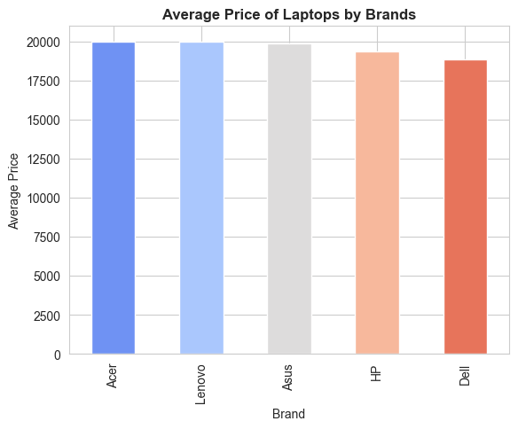
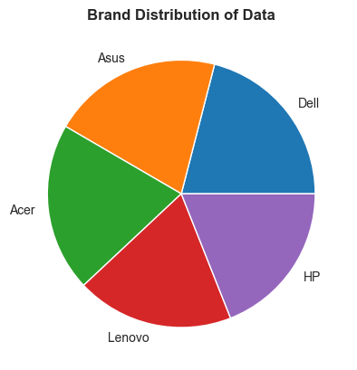

# 💻 Previsão de Preços de Notebooks com Machine Learning

Este projeto utiliza técnicas de Machine Learning para prever o preço de notebooks com base em suas especificações técnicas. A aplicação foi desenvolvida com Python, Streamlit e um modelo Random Forest treinado com dados ficticios.

[👉 Clique em Mim para acessar o projeto no Ar pelo streamlit](https://notebook-price-predictor.streamlit.app/)
---

## 📦 Funcionalidades

- 📈 Previsão de preços com base em:
  - Velocidade do processador (GHz)
  - Memória RAM (GB)
  - Armazenamento (GB)
- 💡 Interface interativa e intuitiva desenvolvida com Streamlit
- 🎉 Visual moderno com uso de CSS personalizado
- 🎯 Modelo treinado com Random Forest para previsões precisas

---

## 📁 Estrutura do Projeto

```ruby
├── dataset
│   └── Laptop_price.csv # Dataset
├── img # Imagens do projeto
│   ├── Average_price_of_laptops_by_brands.png
│   └── Brand_distribution.png
├── app.py # Interface principal com Streamlit 
├── rf_model.pkl # Modelo Random Forest treinado 
├── laptop_price_analysis.ipynb # Notebook com análise exploratória e treinamento 
├── README.md # Documentação do projeto
├── requirements.txt # Dependências
```


---

## 📊 Dados

A base de dados utilizada contém informações sobre notebooks, como marca, velocidade do processador, tamanho da tela e preço. Abaixo, um exemplo de visualização das primeiras entradas:

| Brand  | Processor_Speed | RAM_Size | Storage_Capacity | Screen_Size | Weight  | Price         |
|--------|------------------|-----------|-------------------|--------------|----------|----------------|
| Asus   | 3.83             | 16        | 512               | 11.18        | 2.64     | 17395.09       |
| Acer   | 2.91             | 4         | 1000              | 11.31        | 3.26     | 31607.61       |
| Lenovo | 3.24             | 4         | 256               | 11.85        | 2.03     | 9291.02        |
| Acer   | 3.81             | 16        | 512               | 12.28        | 4.57     | 17436.73       |
| Acer   | 3.27             | 32        | 1000              | 14.99        | 4.19     | 32917.99       |
| ...    | ...              | ...       | ...               | ...          | ...      | ...            |

---

## 📈 Análise Exploratória de Dados

Durante o processo de construção do modelo, foram geradas algumas visualizações importantes para entender os padrões nos dados:

### 💵 Media de preço por Marca



### 📊 Distribuição por Marca



Essas análises ajudaram a selecionar as variáveis mais relevantes para treinar o modelo.

---


## 🚀 Como Executar

1. Clone este repositório:

```ruby
git clone https://github.com/Mogutaa/Predicting-Laptop-Prices-Using-Machine-Learning.git
```
2. Crie um ambiente virtual e instale as dependências:

```ruby
python -m venv venv
pip install -r requirements.txt
```
3. Execute o aplicativo:

```ruby
streamlit run app.py
```
## 📊 Exemplo de Uso
Ao iniciar o aplicativo, você poderá inserir os dados do seu notebook, como velocidade do processador, memória RAM e capacidade de armazenamento. Após clicar no botão de cálculo, a aplicação irá estimar o valor do seu notebook em dólares (USD) com base no modelo treinado.

🛠️ Tecnologias Utilizadas
- Python 3.12
- Pandas & NumPy
- Scikit-learn (Random Forest)
- Jupyter Notebook
- Streamlit
- Joblib

## 📚 Notebook

O notebook `laptop_price_analysis.ipynb` contém:

- Análise exploratória de dados
- Pré-processamento
- Treinamento e validação do modelo
- Salvamento do modelo (rf_model.pkl)

## 📌 Observações

- O modelo está treinado com dados em dólar americano.
- A previsão é baseada em três variáveis, então recomenda-se que estejam dentro da faixa comum de notebooks atuais.

📄 Licença
Este projeto está licenciado sob a MIT License.
